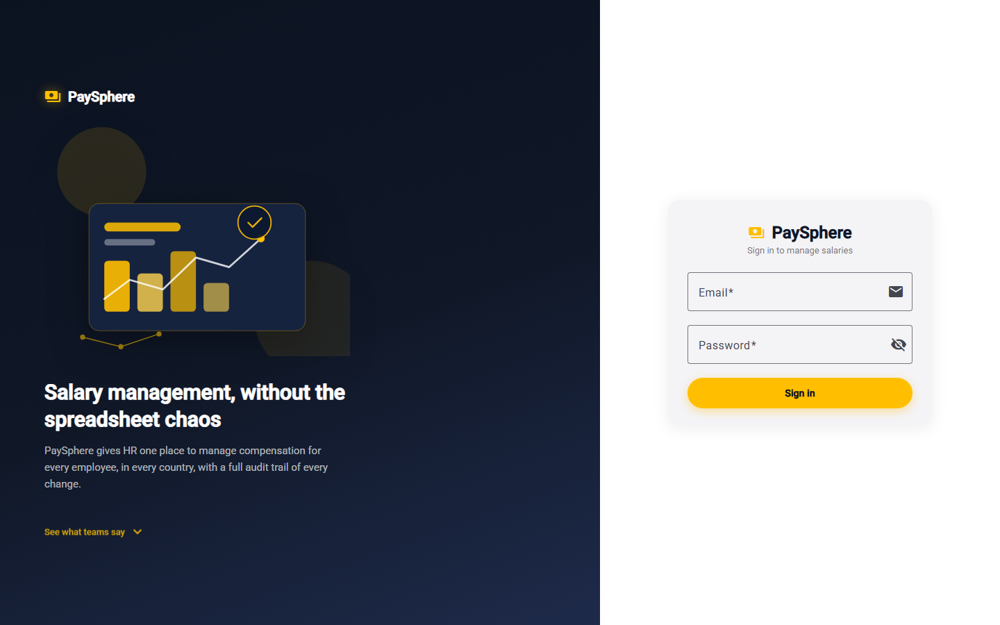
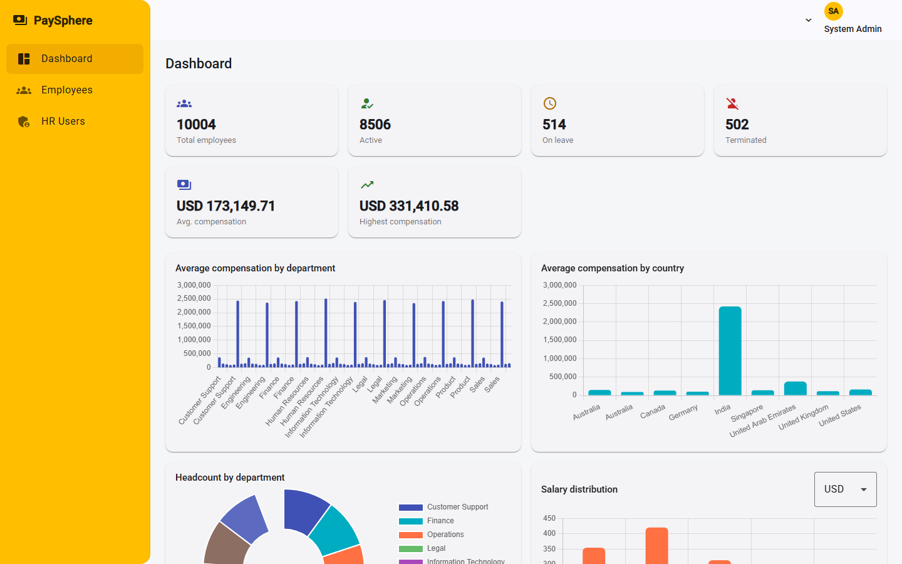
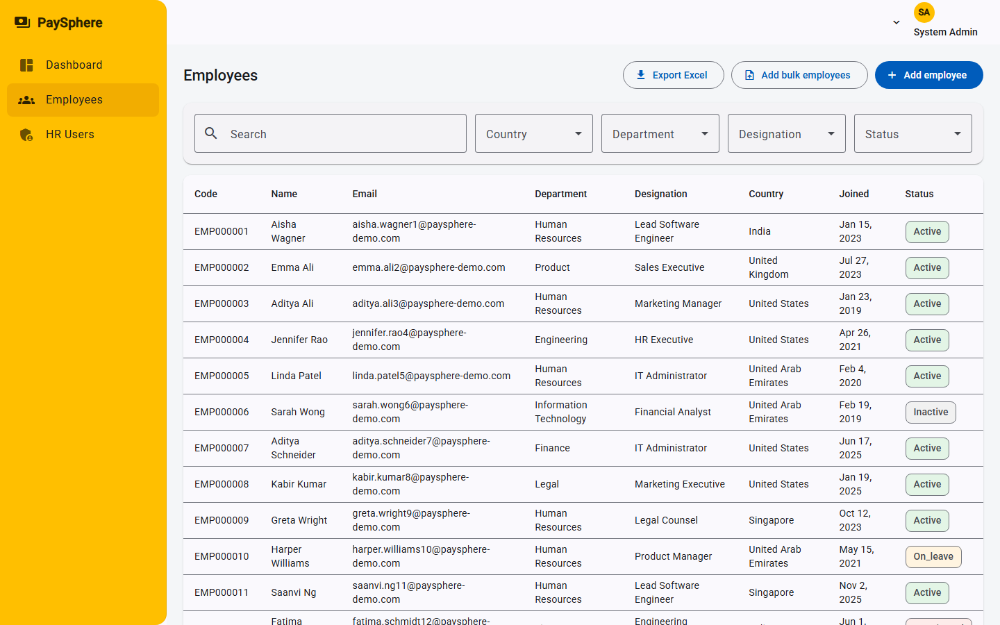
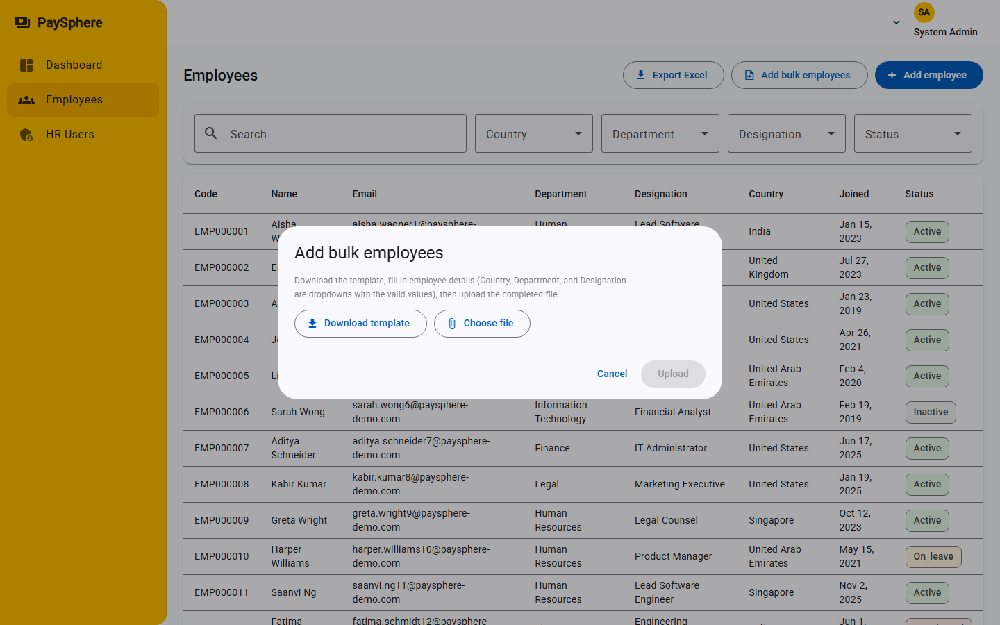
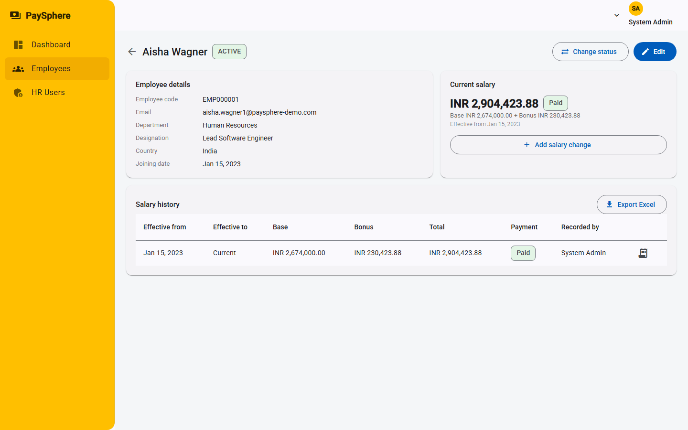
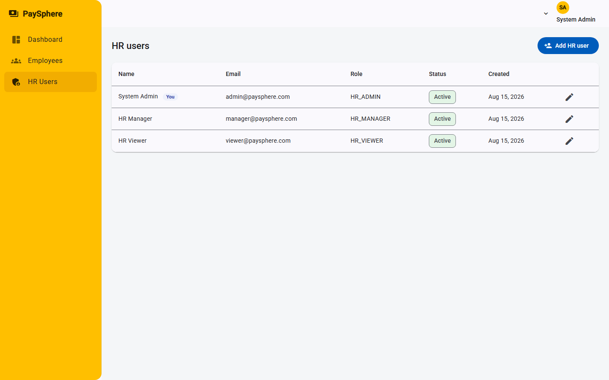

# PaySphere Frontend

Angular 19 (standalone components) + Angular Material single-page app for the PaySphere
Employee Salary Management System. It's the client for the [Spring Boot backend](../PaySphere)
— everything below assumes that API is running and reachable (see [Getting Started](#getting-started)).

## Tech Stack

| | |
|---|---|
| Framework | Angular 19, standalone components, signals |
| UI | Angular Material, custom amber theme |
| Charts | Chart.js via `ng2-charts` |
| Auth | JWT, stored client-side, attached via an HTTP interceptor |
| Forms | Reactive Forms |
| State | Component-local signals + services (no global store — the app doesn't need one) |

## Features

### 1. Branded login



- Split-screen layout: a scroll-revealing hero panel (product pitch, feature highlights,
  testimonials via `IntersectionObserver`) on the left, the sign-in form on the right.
- The hero panel hides below 900px width so the login form gets the full screen on mobile.
- Client-side validation (required fields, email format) before the request is even sent;
  server-side auth failures surface inline under the form.

### 2. Dashboard



- Headcount summary cards (total / active / on-leave / terminated) plus compensation
  stats, all fed by `GET /api/dashboard/summary`.
- Four charts (Chart.js): average compensation by department, average compensation by
  country, headcount by department (donut), and salary distribution — the currency
  selector on the distribution chart lets you flip between whichever currencies exist in
  the data, since compensation figures are never blended across currencies.
- A "Top paid employees" table for a quick leaderboard view.
- Every number here is computed server-side (database aggregation) — the frontend never
  loads the full employee dataset to compute a stat.

### 3. Employee management



- Server-side paginated, filterable, searchable employee table (search by name/code/
  email, filter by country/department/designation/status).
- **Export Excel** — downloads the currently filtered result set as a `.xlsx` report.
- Create/edit employee forms with the same validation rules the backend enforces
  (so a bad submission is caught before the round trip, not just after).
- Status changes (Active/Inactive/On Leave/Terminated) go through a dedicated dialog
  rather than an inline edit, since a status change is a distinct HR action worth
  confirming explicitly.

### 4. Bulk employee upload



- **Download template** — a blank `.xlsx` with the required columns, where Country,
  Department, and Designation are real in-cell Excel dropdowns populated from the
  current master data, so HR can't typo a department name into something invalid.
- **Upload** — parses the filled-in file server-side and processes each row
  independently: a bad row (unknown country, invalid email, duplicate, bad date) is
  reported with a specific reason without blocking the other rows in the same file.
- Results come back as a summary (created/failed counts) plus a table of exactly which
  rows failed and why, so HR can fix just those rows and re-upload if needed.

### 5. Employee detail — salary history & payments



- Full employee profile plus the current salary and complete salary history — history is
  append-only; a new salary record closes the previous one rather than overwriting it.
- **Payment tracking**: each salary record carries a Pending/Paid status. Marking a
  record as paid triggers a payslip email to the employee (best-effort — a delivery
  failure doesn't roll back the payment status, since the status is the source of truth).
- **Payslip download** — generate and download an individual payslip as `.xlsx` on
  demand, independent of the email flow.
- **Export Excel** on the salary history table for a full audit-ready export of one
  employee's compensation history.

### 6. HR user management (admin only)



- Visible only to `HR_ADMIN` — create and edit HR user accounts, assign roles, and
  activate/deactivate accounts. Enforced both by hiding the nav item for other roles
  *and* by the backend rejecting the request regardless of what the UI shows.

## Role-Based Access Control

| Action | HR_ADMIN | HR_MANAGER | HR_VIEWER |
|---|---|---|---|
| View dashboard / employees / salaries | ✅ | ✅ | ✅ |
| Create / edit employees, change status | ✅ | ✅ | ❌ |
| Create salary changes, mark as paid | ✅ | ✅ | ❌ |
| Bulk employee upload | ✅ | ✅ | ❌ |
| Manage HR users | ✅ | ❌ | ❌ |

The UI hides actions a role can't perform, but every one of them is re-checked by the
backend — the frontend restriction is a convenience, not the actual security boundary.

## Responsive Design

The sidebar collapses into a hamburger-triggered overlay drawer below the mobile
breakpoint instead of permanently occupying screen width; dialogs cap at 95% viewport
size; tables scroll horizontally rather than breaking the page layout. Verified at an
iPhone SE viewport across every page in this document.

## Getting Started

### Prerequisites

- Node.js 18+ and npm
- The [backend](../PaySphere) running and reachable (see its README for setup)

### Install & run

```bash
npm install
npm start   # ng serve, http://localhost:4200
```

`src/environments/environment.development.ts` points the dev build at the backend —
update `apiUrl` there if your backend isn't running on the default port. The backend's
CORS config must allow whatever origin you're serving this app from (`FRONTEND_URL` on
the backend, default `http://localhost:4200`).

Sign in with any of the backend's seeded demo accounts (see the backend README), e.g.
`admin@paysphere.com` / `Password@123`.

### Build

```bash
npm run build   # production build, output in dist/
```

### Tests

```bash
npm test   # Karma + Jasmine
```

## Project Structure

```
src/app/
  core/
    guards/          # route guards (auth, role)
    interceptors/     # JWT attachment, global error handling
    models/           # TypeScript interfaces matching backend DTOs
    services/          # HTTP services, one per backend resource
  features/
    auth/login/
    dashboard/
    employees/
      employee-list/       # search/filter/paginate, Excel export, bulk upload dialog
      employee-detail/      # profile, salary history, payslip, mark-as-paid
      employee-form/        # create/edit
    hr-users/
    misc/             # 403 / 404 pages
  layout/shell/        # sidebar + toolbar shell wrapping authenticated routes
  shared/               # reusable components, pipes, utilities
```
